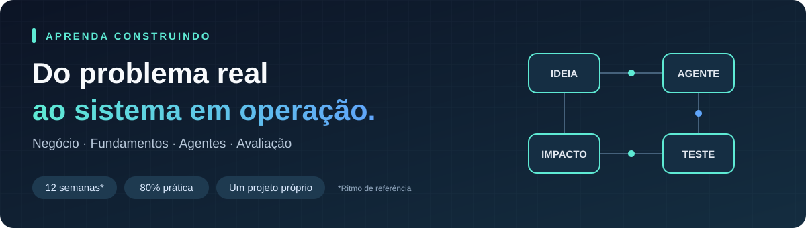

# Jornada do Engenheiro de IA

**Aprenda a construir, testar e operar sistemas de IA que resolvem problemas reais.**

Uma trilha prática para desenvolver as habilidades de um Engenheiro de IA, conectando negócio, fundamentos técnicos e construção de um agente próprio.

**12 semanas de referência · 1 hora por dia · 80% prática · Um projeto do início à operação**

[**Abrir o guia online ↗**](https://ailucasdz.github.io/jornada-engenheiro-de-ia/) · [Trilha](docs/trilha-12-semanas.md) · [Onde estudar](docs/fontes-e-comunidade.md) · [X e Discord](docs/comunidades.md)

---

## Comece por aqui

**Abra a mente para o que você pode construir com IA.** Seu repertório atual é um ponto de partida. Conheça projetos, imagine aplicações no seu dia a dia e dê uma chance às ideias que ainda não sabe executar. A confiança cresce quando você transforma uma possibilidade em um experimento e vê o que consegue construir.

### Minha recomendação — Lucas

**1 · Se puder investir em um curso agora**

Recomendo o curso e a comunidade do **Bruno Okamoto, no [Pixel AI Hub](https://pixelaihub.pixeleducacao.com.br/)**. Considero um ótimo início e o Bruno um ótimo mentor. Comece por lá e continue aqui, aplicando o aprendizado nas entregas da trilha.

> **Não tenho nenhuma parceria com o Bruno Okamoto.** Essa é uma recomendação pessoal, porque considero o trabalho dele um ótimo ponto de partida.

**2 · Se estiver sem orçamento para um curso**

Assista ao meu vídeo **[Crie seu Agente de IA Hermes em menos de 20 minutos](https://youtu.be/VHh2D9agRps)** e coloque seu primeiro agente para funcionar. Use esse Hermes como ponto de partida e siga construindo com as aulas e os exercícios daqui.

Nos dois caminhos, você continua com **um agente que evolui junto com seu aprendizado**. [Veja como aproveitar sua base na trilha](docs/como-estudar.md#comece-com-uma-base-e-evolua-com-ela).

### LLM, agente e Hermes: o que muda?

- **LLM** é o modelo de linguagem: interpreta o contexto e gera respostas ou pedidos de uso de ferramentas.
- **Agente de IA** é um sistema que combina o modelo com instruções, contexto, ferramentas e um ciclo de execução para realizar tarefas. O modelo pode escolher os próximos passos; o sistema executa as ações permitidas.
- **Hermes Agent** é um projeto da **Nous Research** que já reúne essa estrutura, com ferramentas, memória e habilidades reutilizáveis. Você configura um modelo e usa essa base para construir seu agente.

Por exemplo: o modelo pode sugerir como organizar uma pesquisa; um agente com as ferramentas adequadas pode consultar as fontes e salvar um relatório. Consulte a [documentação oficial do Hermes](https://hermes-agent.nousresearch.com/docs/) e aprofunde na [aula de agentes e ferramentas](aulas/05-agentes-e-ferramentas.md).

## Encontre o que precisa

| Quero… | Acesse |
| --- | --- |
| **Começar hoje** | [Como estudar: 80% prática e 20% teoria](docs/como-estudar.md) |
| **Saber o que fazer em cada semana** | [Trilha de 12 semanas, com entregas e fontes](docs/trilha-12-semanas.md) |
| **Aprender os conceitos da etapa** | [Aulas: explicação, fontes e prática no mesmo lugar](aulas/README.md) |
| **Estudar nas fontes oficiais** | [OpenAI, Anthropic, Google, GitHub, Microsoft e outras referências](docs/fontes-e-comunidade.md) |
| **Pesquisar uma dúvida** | [Como pesquisar no Google e nas documentações](docs/como-pesquisar.md) |
| **Acompanhar novidades e trocar experiências** | [X, Discord e comunidades](docs/comunidades.md) |
| **Trabalhar no meu agente** | [Projeto central](docs/projeto-central.md) e [modelos para preencher](modelos/README.md) |

**Leia tudo no navegador:** o [guia online](https://ailucasdz.github.io/jornada-engenheiro-de-ia/) reúne aulas, exercícios, fontes e busca por assunto. Aqui no GitHub, cada pasta tem um índice com o que ler e por onde começar.

## 80% prática. 20% teoria. Toda semana.

| Construir · 4 horas por semana | Estudar · 1 hora por semana |
| --- | --- |
| Implementar, integrar, testar, depurar e melhorar o mesmo agente. | Ler fundamentos, consultar documentação e acompanhar X e Discord com uma pergunta concreta. |
| **Saída:** uma entrega verificável e seu resultado registrado. | **Saída:** um conceito entendido e uma decisão para aplicar no projeto. |

Em uma sessão de uma hora, use **12 minutos para estudar e 48 para aplicar**. Ajuste a distribuição quando precisar: vale a proporção ao longo da semana. A leitura prepara a próxima mudança; o teste mostra o que estudar depois.

→ [Ver uma sessão de exemplo e o ritmo semanal](docs/como-estudar.md)

## Seu próximo passo: construir

Escolha um problema real e acompanhe sua solução ganhar forma. Ao longo da jornada, você vai desenhar um fluxo, conectar dados e ferramentas, construir um agente e descobrir o que precisa melhorar para colocá-lo em uso.

Cada etapa combina uma entrega prática com os conceitos que ajudam a tomar decisões. Você estuda, aplica, observa o resultado e volta ao projeto com mais repertório.

> **O projeto cresce junto com você.** A mesma solução evolui durante a trilha, da primeira hipótese ao piloto com resultados e limites documentados.

## O que você vai aprender a fazer

| Habilidade | Como ela aparece na prática |
| --- | --- |
| **Escolher um problema que vale resolver** | Entender um processo, definir uma hipótese e medir o resultado de negócio. |
| **Desenhar a solução** | Organizar fluxos, dados, integrações, permissões e pontos de intervenção humana. |
| **Conduzir a construção com IA** | Orientar um agente de código e verificar se a implementação atende ao comportamento esperado. |
| **Construir um agente com ferramentas** | Conectar o modelo a fontes de informação e ações com limites definidos. |
| **Avaliar e corrigir** | Testar respostas, investigar falhas e acompanhar qualidade, custo e latência. |
| **Colocar em uso e evoluir** | Rodar um piloto, comparar resultados e decidir o próximo passo com evidências. |

## Seu caminho em um mapa

[**Explorar o mapa interativo ↗**](https://ailucasdz.github.io/jornada-engenheiro-de-ia/mapa.html) · Diagrama criado com [Archify](https://github.com/tt-a1i/archify).

## Como a jornada funciona

O ritmo de referência é **1 hora por dia, 5 dias por semana**: cerca de 4 horas de prática e 1 hora de estudo. A proporção 80/20 orienta o trabalho; ajuste o ritmo conforme as dificuldades do projeto.

| Etapa | Foco | O que você constrói |
| --- | --- | --- |
| **Semanas 1–3 · Entender e planejar** | Problema, negócio, produto e métodos ágeis | Um primeiro protótipo, com hipótese, métrica e entregas priorizadas. |
| **Semanas 4–6 · Criar a base** | Fundamentos de IA, integrações e dados | Uma comparação entre regras e LLM, uma entrada de dados e um histórico de execução. |
| **Semanas 7–8 · Dar capacidade de ação** | Agentes, ferramentas e automação confiável | Um agente que consulta informações e executa uma ação em ambiente de teste. |
| **Semanas 9–10 · Verificar e melhorar** | Avaliação e observabilidade | Casos de teste e registros para investigar erros, custo e tempo de resposta. |
| **Semanas 11–12 · Operar e aprender** | Piloto, feedback e melhoria | Uma demonstração com resultados, decisões e limitações documentadas. |

**Avance pelas entregas, no seu ritmo.** As 12 semanas são uma referência. Quando uma etapa revelar uma lacuna, use o projeto para aprofundar o aprendizado.

→ [Ver o plano completo de 12 semanas](docs/trilha-12-semanas.md)

## Um agente próprio, do problema ao piloto

Você escolhe o contexto: atendimento, pesquisa, operação, análise comercial ou outro processo ao qual tenha acesso. A trilha usa **qualificação de leads** como exemplo para mostrar como cada decisão se transforma em implementação.

A evolução do projeto passa por seis entregas:

1. **Mapear e registrar** — receber uma entrada, validar os dados e salvar o histórico.
2. **Classificar** — comparar regras simples e modelo para identificar a intenção.
3. **Responder com fonte** — consultar informação confiável e encaminhar o que não tem base.
4. **Agir com limite** — conectar uma ferramenta com permissões e intervenção humana definidas.
5. **Tratar falhas** — lidar com duplicatas, indisponibilidade e execuções incompletas.
6. **Medir e revisar** — avaliar o comportamento e comparar o resultado com a situação inicial.

→ [Explorar o projeto central](docs/projeto-central.md)

## Comece sua jornada

Parta do curso ou do [vídeo do Hermes](https://youtu.be/VHh2D9agRps) e aproveite o que já colocou para funcionar:

1. **Escolha um processo real.** Leia [o plano da trilha](docs/trilha-12-semanas.md) e identifique um problema que você consiga observar.
2. **Dê forma à ideia.** Preencha [a ficha do projeto](modelos/ficha-do-projeto.md) com a hipótese, o escopo e a métrica principal.
3. **Construa a primeira entrega.** Use [o projeto central](docs/projeto-central.md) como referência e adapte ao seu contexto.
4. **Registre o que aprendeu.** Documente [os experimentos](modelos/experimento.md) e mantenha [os casos de avaliação](modelos/casos-de-avaliacao.md) atualizados.

## Aprenda o conceito e aplique no projeto

Cada etapa traz a explicação que você precisa, uma leitura recomendada e um exercício no seu agente. História, fundamentos e decisões técnicas fazem parte desse caminho.

| Na etapa de… | Você aprende… | Comece pela aula |
| --- | --- | --- |
| **Escolher o problema** | Como a IA evoluiu, quais promessas falharam e como definir um escopo útil. | [História e problemas](aulas/01-historia-e-problemas.md) |
| **Entender o modelo** | Redes neurais, treinamento, atenção, tokens, contexto e alucinação. | [Modelos e aprendizado](aulas/02-modelos-e-aprendizado.md) |
| **Conectar a solução** | APIs, dados, estado e atualização das fontes. | [Integrações e dados](aulas/03-integracoes-e-dados.md) |
| **Responder com informação** | Embeddings, busca, RAG e quando considerar fine-tuning. | [Contexto e RAG](aulas/04-contexto-e-rag.md) |
| **Dar capacidade de ação** | Ferramentas, agentes, MCP e limites de autonomia. | [Agentes e ferramentas](aulas/05-agentes-e-ferramentas.md) |
| **Verificar o resultado** | Avaliação, diagnóstico, observabilidade e confiabilidade. | [Avaliação e confiabilidade](aulas/06-avaliacao-e-confiabilidade.md) |
| **Colocar em uso** | Custo, latência, operação e explicação das decisões. | [Operação e comunicação](aulas/07-operacao-e-comunicacao.md) |

→ [Navegar por todas as aulas](aulas/README.md)

## Onde estudar e se manter atualizado

| Fonte | Use para |
| --- | --- |
| [OpenAI — Learn e Cookbook](docs/fontes-e-comunidade.md#openai) | Guias, exemplos de implementação e avaliações. |
| [Anthropic — Academy e Engineering](docs/fontes-e-comunidade.md#anthropic) | Colaboração com IA, ferramentas e desenho de agentes. |
| [Google — fundamentos e Gemini](docs/fontes-e-comunidade.md#google) | Entender modelos e experimentar integrações. |
| [GitHub — Learn e Skills](docs/fontes-e-comunidade.md#github) | Versionar, revisar e organizar o projeto. |
| [Microsoft — Learn e cursos abertos](docs/fontes-e-comunidade.md#microsoft) | Estudar conceitos e reproduzir exercícios de IA generativa. |
| [Outras bases técnicas](docs/fontes-e-comunidade.md#outras-bases) | Hugging Face, HTTP, SQL, Lean e métodos ágeis. |

Escolha **uma leitura principal por etapa**. O [guia de fontes](docs/fontes-e-comunidade.md) associa cada recomendação a uma aplicação no agente; o [guia de pesquisa](docs/como-pesquisar.md) traz buscas prontas para aprofundar dúvidas.

### Acompanhe, converse e experimente

- **X:** comece por [@ailucasdz](https://x.com/ailucasdz) e explore [os perfis que acompanha](https://x.com/ailucasdz/following). Guarde até três ideias por semana e transforme uma delas em experimento.
- **Discord:** participe de [Nous Research](https://discord.gg/NousResearch) e [OpenClaw](https://discord.gg/clawd) para acompanhar projetos, discutir implementação e investigar bloqueios.
- **Rotina:** inclua esse acompanhamento nos 20% de estudo e leve uma pergunta, um resultado ou uma falha reproduzível para a conversa.

→ [Abrir o guia de X e Discord](docs/comunidades.md)

## O que você leva ao concluir

Um agente demonstrável em um processo real ou ambiente de teste representativo, acompanhado de:

- Mapa do fluxo e critérios de aceitação.
- Casos de avaliação com resultados registrados.
- Métricas antes e depois do piloto.
- Decisões técnicas e falhas conhecidas documentadas.

Esse conjunto permite mostrar **o que você construiu, por que escolheu esse caminho e como verificou o resultado**.

> Conduzir a construção exige entender o comportamento esperado, os limites do sistema e as evidências de que ele funciona. Quando precisar ler código, logs ou SQL, aprenda o necessário e aplique no projeto.

## Navegue pelas pastas

| Pasta | O que você encontra |
| --- | --- |
| [docs/](docs/README.md) | Roteiro, método de estudo, projeto, fontes, pesquisa e comunidades. |
| [aulas/](aulas/README.md) | Conteúdo da formação integrado às referências e aos exercícios. |
| [modelos/](modelos/README.md) | Ficha do projeto, experimentos e casos de avaliação. |
| [assets/](assets/README.md) | Capa e mapa visual usados neste guia. |

Para colaborar com os textos e atualizar o site, consulte [o guia de contribuição](CONTRIBUTING.md).
