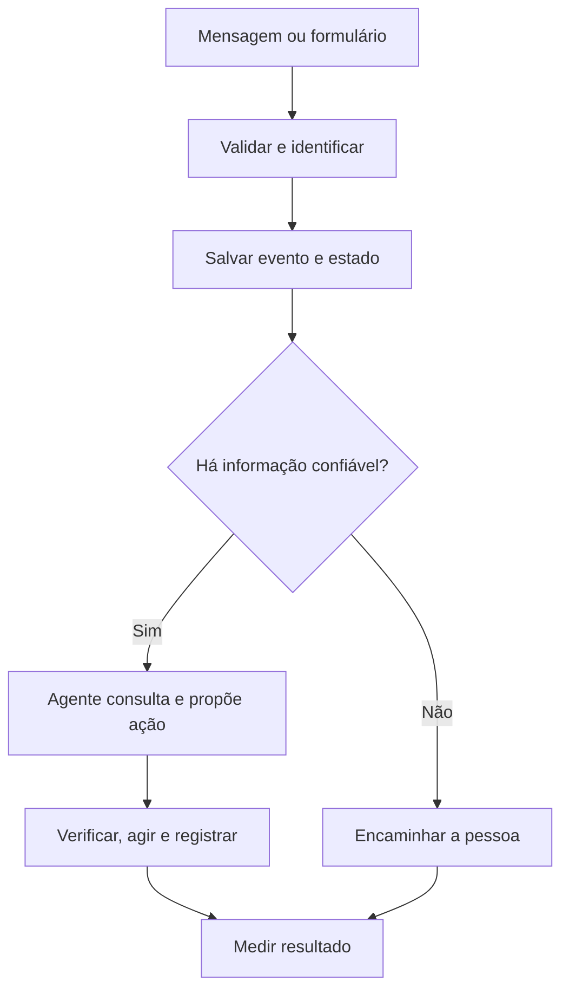

# Projeto central: seu próprio agente

[← Índice da pasta](README.md) · [Início](../README.md)

O tema é escolhido por você. Pode ser atendimento, pesquisa, operação, análise comercial ou outro processo ao qual tenha acesso legítimo. Para tornar a trilha concreta, usamos **qualificação de leads** como exemplo; adapte os nomes e as métricas ao seu contexto.

## Definição inicial

**Problema:** leads recebidos fora do horário aguardam resposta e parte deles não é acompanhada.

**Hipótese de produto:** um fluxo que registra o lead, responde perguntas com informação válida e encaminha exceções reduz o tempo de primeira resposta sem piorar conversão ou qualidade.

**Métrica principal:** tempo mediano até a primeira resposta útil. **Métricas de proteção:** taxa de agendamento, respostas incorretas, escalonamentos, custo por lead e reclamações.

## Evolução em seis incrementos

1. **Mapear e registrar:** entrada → validação → criação/atualização no CRM → histórico. Sem LLM ainda.
2. **Classificar:** distinguir pergunta frequente, intenção comercial e caso desconhecido. Compare regras simples e modelo.
3. **Responder com fonte:** consultar dados atuais e registrar qual fonte sustentou a resposta. Encaminhar o que não tem base.
4. **Agir com limite:** usar ferramenta para atualizar uma oportunidade ou sugerir agendamento, com permissões mínimas e aprovação para ações sensíveis.
5. **Resistir a falhas:** tratar evento duplicado, indisponibilidade da API, timeout, retry e execução parcial.
6. **Medir e revisar:** rodar evals, examinar traces, comparar com a linha de base e fazer uma revisão com usuários.

## Fluxo de referência

## Perguntas de arquitetura

- Onde está a fonte de verdade do lead? Quem pode ler e escrever?
- Qual identificador impede processar duas vezes a mesma mensagem?
- O que acontece se CRM, modelo ou WhatsApp ficar indisponível?
- O que o agente pode fazer sozinho e o que exige uma pessoa?
- Quais dados devem ser minimizados, protegidos ou excluídos dos logs?
- Como alguém reproduz uma decisão errada sem expor dados privados?

## Definição de pronto do piloto

- Fluxo e modelo de dados documentados.
- Pelo menos 20 casos de avaliação representativos, incluindo erros e exceções, com resultados registrados.
- Um teste de integração para a entrada e outro para a ação no sistema externo.
- Duplicatas e falhas transitórias tratadas sem criar ações repetidas.
- Custos, latência, acerto e resultado de negócio visíveis.
- Acesso mínimo, segredos fora do repositório, ponto de desligamento e responsável humano definidos.

O número de casos é um ponto de partida para aprender; não é um selo de segurança ou de prontidão universal. Amplie a avaliação conforme o risco e o volume real.
