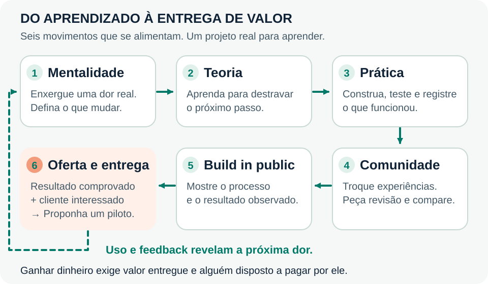
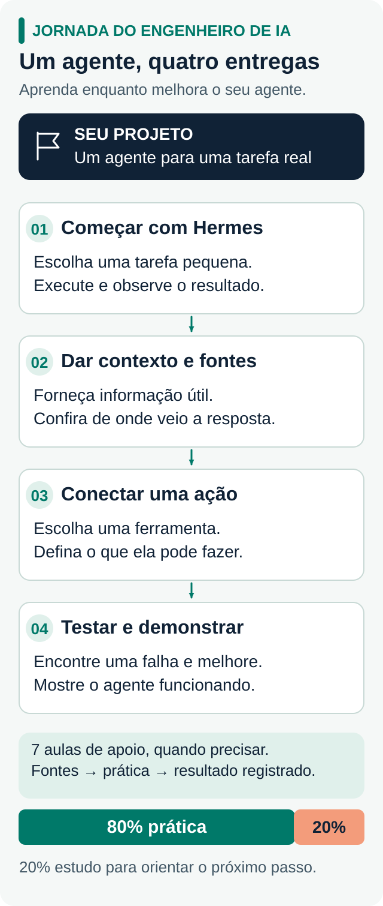

# Entenda a IA pelos desenhos

[← Início](../README.md) · [Explorar as aulas](../aulas/README.md)

Use os mapas para enxergar como as peças se conectam. Cada desenho acompanha uma aula: observe o fluxo, explique com suas palavras e aplique no seu agente. Abra a imagem para ver os detalhes.

## Aprendizado, comunidade e valor

 <small>Prévia compacta · clique no desenho para ampliar.</small>

O uso e o retorno das pessoas ajudam a escolher a próxima melhoria. A oferta parte de um resultado demonstrado e de alguém interessado em usá-lo.

 <small>Prévia compacta · clique no desenho para ampliar.</small>

A analogia ajuda a reconhecer as peças do agente. Você define o objetivo e os limites e confere o resultado.

## Veja o caminho completo

 <small>Prévia compacta · clique no desenho para ampliar.</small>

[Ver o plano de estudo](../comece-aqui/trilha-pratica.md) · [Explorar o mapa interativo com Archify](https://ailucasdz.github.io/jornada-engenheiro-de-ia/mapa.html)

## Da história ao funcionamento

**01 · Como chegamos até aqui**

 <small>Prévia compacta · clique no desenho para ampliar.</small>

→ [Ler a aula sobre história e escolha de problemas](../aulas/README.md#aula-01)

**02 · O modelo dentro do agente**

 <small>Prévia compacta · clique no desenho para ampliar.</small>

→ [Entender modelos e aprendizado](../aulas/README.md#aula-02)

## Da informação à ação

**03 · Por onde passam os dados**

 <small>Prévia compacta · clique no desenho para ampliar.</small>

→ [Aprender a conectar serviços e dados](../aulas/README.md#aula-03)

**04 · Como responder usando uma fonte**

 <small>Prévia compacta · clique no desenho para ampliar.</small>

→ [Aprender sobre contexto e busca](../aulas/README.md#aula-04)

**05 · Como um agente age e decide parar**

 <small>Prévia compacta · clique no desenho para ampliar.</small>

→ [Aprender sobre ferramentas e autonomia](../aulas/README.md#aula-05)

## Do teste ao uso

**06 · Como descobrir se melhorou**

 <small>Prévia compacta · clique no desenho para ampliar.</small>

→ [Criar seus casos de teste](../pratique/casos-de-avaliacao.md)

**07 · Como colocar em uso e acompanhar**

 <small>Prévia compacta · clique no desenho para ampliar.</small>

→ [Preparar e acompanhar um piloto](../aulas/README.md#aula-07)

## Mapa interativo da jornada

[**Abrir e explorar o mapa →**](https://ailucasdz.github.io/jornada-engenheiro-de-ia/mapa.html) · Criado com [Archify](https://github.com/tt-a1i/archify).
